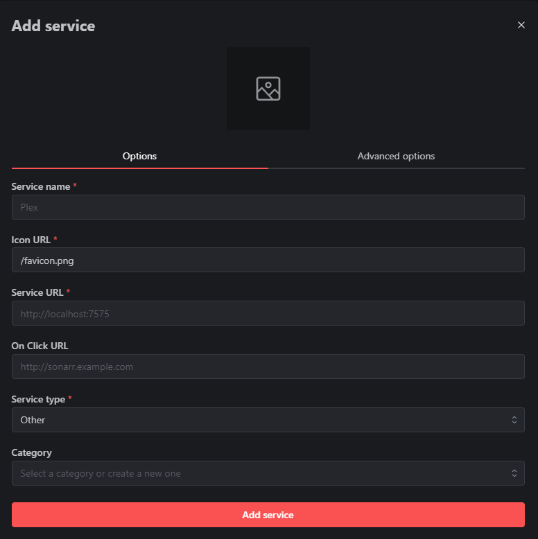

# HomeNetflix
## Requirments
Current system supported :
* Ubuntu
* Debian
## Install
First you have to use sudo
```bash
sudo su
```
Then, clone the repository :
```
git clone https://github.com/MATMAF/HomeNetflix.git
cd HomeNetflix
```
Now execute the script
```
chmod +x ./install.sh
./install.sh
```
## Configuration
First you have to go to your server : http://SERVER_IP

Now you can add a service

<p align="center">

</p>

You have to add all container.

For the service url it's http://SERVER_IP:PORT

This is the list of service name and ports for services.
* [Jellyfin](https://jellyfin.org/) 8096
* [Portainer](https://www.portainer.io/) 9000
* [Transmission](https://transmissionbt.com/) 9091
* [WebSSH](https://github.com/huashengdun/webssh) 8888

You can also add in setting
* Date
* Docker (manage containers)
* Ping (show if the container is run)
* Search Bar (search somethings on the web)
* Torrent (view the advancement of downloading)
* Weather

For Torrent you have to edit transmission and active service type